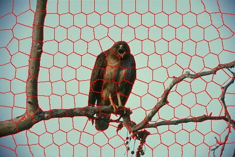
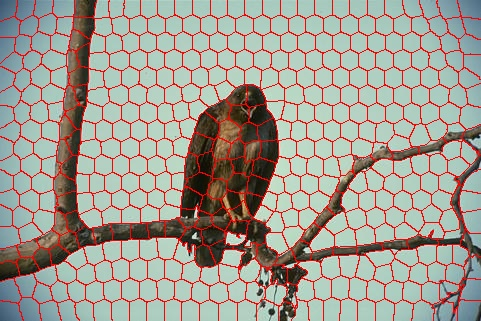

# SLIC Superpixel Modification

We modified the [SLICO version of slic algorithm](http://ivrg.epfl.ch/research/superpixels) to work with OpenCV2, and make it easy to use.

## Class explanation

* `void SLIC::GenerateSuperpixels(cv::Mat& img, UINT numSuperpixels)`

	Perform SLIC algorithm on the given image with the given number of superpixels.
	
	img - 24-bit or 8-bit cv::Mat 
	
	numSuperpixels - an appropriate number, no more than total number of pixels

* `cv::Mat SLIC::GetImgWithContours(cv::Scalar color)`

	Get the result image with contours on the given color.
	
	color - If input image is 24-bit, the color may be cv::Scalar(255, 0, 0) or cv::Scalar(0, 255, 0) or cv::Scalar(0, 0, 255)

	If input image is 8-bit, the color may be cv::Scalar(0) or cv::Scalar(128) or cv::Scalar(255)

* `int* SLIC::GetLabel()`

	Get label on each pixel which shows the number of superpixel it belongs to.

## Example

original image

200 superpixels

500 superpixels

